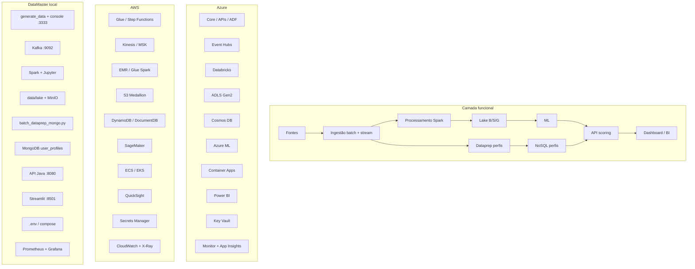

# Contexto para pedido de arquitetura de software (Azure × AWS × Local)

Use este documento **inteiro ou em partes** ao pedir diagramas (IA, arquiteto, draw.io, Mermaid, Lucidchart, etc.). O objetivo é uma arquitetura **peça a peça**, com **três colunas paralelas**: **Azure (alvo)** · **AWS (equivalente)** · **DataMaster local (sua demo)**.

---

## 1. O que pedir (briefing em uma frase)

> Desenhe a arquitetura de uma **plataforma de detecção de fraudes bancárias** em três camadas alinhadas por **função** (não por nuvem isolada): para cada bloco funcional, mostre o componente **Azure**, o **equivalente AWS** e a **implementação local Docker** do projeto DataMaster, com setas de fluxo de dados (batch, streaming, online) e camadas transversais (segurança, observabilidade, LGPD).

---

## 2. Domínio e objetivo do sistema

| Item | Descrição |
|------|-----------|
| **Caso de uso** | Detecção de fraude em transações bancárias (PIX, cartão, internacional, etc.) |
| **Público da apresentação** | Banca de **Engenharia de Dados** (não só ML) |
| **Meta de negócio** | Decisão em tempo real (&lt; 2 s), baixo falso positivo, rastreio e conformidade LGPD |
| **Capacidade-alvo (narrativa)** | 10M+ transações/dia com autoscaling |
| **Padrão arquitetural** | **Lambda**: camada *speed* (streaming + API) + camada *batch* (lake + perfis históricos + retreino ML) |

---

## 3. Visão em camadas (independente de nuvem)

Organize o diagrama nestas **faixas horizontais** (de cima para baixo ou da esquerda para a direita):

1. **Fontes** — core bancário, APIs de parceiros, arquivos históricos, simulador de carga  
2. **Ingestão** — batch (orquestração ETL) + streaming (fila particionada)  
3. **Processamento** — Spark / jobs de dataprep, qualidade, features  
4. **Armazenamento** — lake Medallion (Bronze/Silver/Gold) + OLTP + NoSQL de perfis + cache + object storage  
5. **ML & serving** — treino, registro de modelo, scoring online  
6. **API & canais** — REST de análise, alertas, liberação de casos  
7. **Consumo** — dashboard operacional, BI, assistente IA (contexto de fraudes)  
8. **Transversal** — identidade, segredos, governança, LGPD, métricas, logs, tracing  

---

## 4. Mapa peça a peça (função → Azure → AWS → Local)

| # | Função / peça | Azure (alvo + Terraform `apresentacao/`) | AWS (equivalente usual) | DataMaster local (Docker / código) |
|---|---------------|------------------------------------------|-------------------------|-------------------------------------|
| 1 | **Hub / navegação demo** | — (portal interno) | — | `portal` nginx **:8880** — links, slides, botão batch-prep |
| 2 | **Fontes / simulação** | Core, APIs, exportações | Mesmo | `scripts/generate_data.py`, console **:3333** |
| 3 | **Orquestração batch** | **Azure Data Factory** | Glue Workflow, Step Functions | `demo_full_stack.sh`, `batch-prep`, scripts Python |
| 4 | **Streaming ingestão** | **Event Hubs** (namespace + hub `transactions`) | Kinesis Data Streams, MSK (Kafka) | **Kafka** + Zookeeper **:9092** |
| 5 | **Processamento distribuído** | **Azure Databricks** (opcional TF) | EMR, Glue Spark | **Spark** master/worker, `spark-job`, Jupyter **:8888** |
| 6 | **Lake objeto (Medallion)** | **ADLS Gen2** containers `bronze`, `silver`, `gold` | S3 + prefixos; Lake Formation na governança | `data/lake/`, **MinIO** buckets bronze/silver/gold **:9000** |
| 7 | **Dataprep batch → perfis** | ADF + job Databricks → agregação por `user_id` | Glue ETL → DynamoDB/DocumentDB | `scripts/batch_dataprep_mongo.py` → **MongoDB** `user_profiles` |
| 8 | **NoSQL perfis (serving)** | **Cosmos DB** (API Mongo/SQL) | DynamoDB, DocumentDB | **MongoDB** **:27017** coleção `user_profiles` |
| 9 | **OLTP relacional** | **PostgreSQL Flexible Server** | RDS Aurora PostgreSQL | **Postgres** **:5432** |
| 10 | **Cache** | **Azure Cache for Redis** | ElastiCache Redis | **Redis** **:6379** |
| 11 | **ML treino / registro** | **Azure Machine Learning** (opcional TF) | SageMaker | `models/`, notebooks, narrativa AML |
| 12 | **API scoring (tempo real)** | **Container Apps** + **ACR** (imagem Java) | ECS/EKS/Fargate + ALB | **API Java Spring** **:8080** — `POST /analyze` consulta Mongo |
| 13 | **Dashboard operacional** | **Power BI / Microsoft Fabric** | QuickSight | **Streamlit** **:8501** — filtro fraudes, liberar, chat DeepSeek |
| 14 | **Assistente IA (analista)** | Azure OpenAI (produção) | Bedrock / OpenAI via VPC | **DeepSeek** via API (`DEEPSEEK_API_KEY`) |
| 15 | **Alertas / motor** | Logic Apps, filas, canais | SNS, SQS, EventBridge | Alertas em memória + KPIs no dashboard |
| 16 | **DW / SQL analítico** | **Synapse / Fabric** (opcional TF) | Redshift, Athena | Narrativa + Gold no lake |
| 17 | **Governança / catálogo** | **Microsoft Purview** | Glue Catalog + Lake Formation | `config/governanca.yaml`, DQ na API |
| 18 | **Segredos** | **Key Vault** | Secrets Manager, SSM, KMS | `.env`, `DEEPSEEK_API_KEY` |
| 19 | **Identidade / RBAC** | **Microsoft Entra ID** | IAM + SSO | Narrativa (demo sem IdP) |
| 20 | **Métricas / logs** | **Monitor** + **Log Analytics** | CloudWatch Metrics + Logs | **Prometheus** **:9090**, **Grafana** **:3000** |
| 21 | **APM / tracing** | **Application Insights** | X-Ray, OTel → CloudWatch | Health `/health`, métricas na API |
| 22 | **LGPD / mascaramento** | Políticas Purview + API | Macie, masking no pipeline | `POST /api/v1/lgpd/mask` |
| 23 | **IaC** | `infrastructure/terraform/apresentacao` | Terraform AWS (módulos futuros) | `docker-compose.yaml` |

---

## 5. Fluxos de dados (obrigatório no diagrama)

### 5.1 Fluxo batch (tratamento de dados — destaque para a banca)

```text
[Fontes históricas / JSON / ADLS Bronze]
        → [Dataprep agregado por user_id]
        → [Mongo/Cosmos: user_profiles]
        → (consulta na análise online)
```

**Local:** `data/transactions.json` → `batch_dataprep_mongo.py` → MongoDB → API `analyze` com `user_id` → `anomaly_reasons` + boost no score.

### 5.2 Fluxo streaming (speed layer)

```text
[Transação em tempo real]
        → [Event Hubs / Kafka]
        → [Consumer / Spark streaming — opcional na demo]
        → [API analyze]
        → [Dashboard + alertas]
```

### 5.3 Fluxo lake Medallion (analítico + ML)

```text
[Landing bruto]
        → BRONZE (schema-on-read)
        → SILVER (limpeza, DQ)
        → GOLD (features / wide table ML)
        → [Treino modelo] → [API scoring]
```

**Local:** `scripts/spark_local_pipeline.py`, `notebooks/01_dataprep_dq.py`, saída em `data/lake/`.

### 5.4 Fluxo online (serving unificado)

```text
[Canal / simulador]
        → POST /api/v1/transactions/analyze
        → [Lê user_profiles no Mongo/Cosmos]
        → [Score + is_fraud + recommended_action]
        → [Streamlit: filtro | liberar | chat IA]
```

---

## 6. Arquitetura Lambda (como explicar no desenho)

Desenhe **dois braços** que convergem na **API**:

| Braço | O que faz | Azure | AWS | Local |
|-------|-----------|-------|-----|-------|
| **Speed** | Baixa latência, evento a evento | Event Hubs → API / stream processor | Kinesis/MSK → Lambda/ECS | Kafka → API Java |
| **Batch** | Reamaterialização, agregados, lake, perfis | ADF → ADLS → Databricks; perfis → Cosmos | Glue → S3 → EMR; perfis → DynamoDB | batch-prep → Mongo; Spark → lake |

**Serving unificado:** mesma API e mesmo painel consomem sinais dos dois braços.

---

## 7. Peças só na narrativa Azure (sem container local 1:1)

Inclua no diagrama como caixa **“produção / roadmap”** ou tracejado:

| Peça Azure | Papel | Substituto na demo local |
|------------|-------|---------------------------|
| Data Factory | Orquestração batch corporativa | Scripts + `demo_full_stack.sh` |
| Purview | Catálogo, linhagem, políticas | `governanca.yaml` + fala |
| Power BI | BI corporativo | Streamlit |
| API Management | Gateway, throttling, OAuth | Swagger direto na API |

---

## 8. Endpoints e artefatos locais (para rotular caixas)

| Artefato | URL / caminho |
|----------|----------------|
| Portal | http://localhost:8880 |
| API Swagger | http://localhost:8080/swagger-ui.html |
| Batch stats | `GET /api/v1/batch/profile-stats` |
| Analyze | `POST /api/v1/transactions/analyze` (body com `user_id`) |
| Liberar fraude | `POST /api/v1/transactions/{id}/release` |
| Chat contexto | `POST /api/v1/assistant/chat` |
| Dashboard | http://localhost:8501 |
| Console dados | http://localhost:3333 |
| Terraform Azure | `infrastructure/terraform/apresentacao/` |
| Mapa resumido | `infrastructure/MAPA_LOCAL_AZURE.md` |
| Slides | `portal/banca.html` |

---

## 9. Requisitos visuais do diagrama pedido

Peça explicitamente:

1. **Três colunas** (Azure | AWS | Local) **alinhadas por linha funcional**, mesma ordem vertical em todas.  
2. **Setas de fluxo** com legenda: batch (azul), streaming (verde), online/API (amarelo).  
3. **Subgraph Medallion** (Bronze → Silver → Gold) em cada coluna onde houver lake.  
4. **Subgraph transversal** na base: Key Vault / Secrets Manager / .env · Monitor / CloudWatch / Prometheus.  
5. **Caixa destacada** “Batch perfis → NoSQL → API” (diferencial da apresentação).  
6. **Legenda** com ícones ou cores; evitar mais de ~25 caixas por coluna (agrupar “Fontes” em um bloco).  
7. **Formato entregue:** Mermaid `flowchart TB` + versão exportável (PNG/SVG) ou draw.io XML.  
8. **Idioma:** rótulos em **português**; nomes de produtos em inglês (Event Hubs, S3, etc.).  

---

## 10. Prompt pronto para copiar e colar

```
Preciso de um diagrama de arquitetura de software para uma plataforma de detecção de fraudes bancárias.

Requisitos:
- Três colunas paralelas alinhadas por FUNÇÃO: (1) Microsoft Azure, (2) AWS equivalente, (3) minha implementação local Docker "DataMaster".
- Mostrar arquitetura Lambda: braço batch (lake Medallion + dataprep de perfis históricos em NoSQL) e braço speed (streaming + API tempo real).
- Destacar o fluxo: histórico → dataprep por user_id → MongoDB/Cosmos user_profiles → API Java consulta perfil no POST /analyze → dashboard filtra fraudes, libera casos e chat IA.
- Incluir camadas transversais: Key Vault/Secrets, Monitor/CloudWatch/Prometheus, LGPD, ML treino.
- Lake em três camadas: Bronze, Silver, Gold (ADLS / S3 / MinIO+data/lake).
- Streaming: Event Hubs / Kinesis/Kafka / Kafka local.
- API: Container Apps / ECS-EKS / Spring Boot :8080.
- BI: Power BI / QuickSight / Streamlit :8501.

Use o mapa funcional abaixo (cada linha = uma linha no diagrama):

[COLE A TABELA DA SEÇÃO 4 DESTE DOCUMENTO]

Fluxos obrigatórios com setas numeradas:
1) Batch perfis: fontes → dataprep → NoSQL → API
2) Streaming: fonte → fila → API
3) Lake: Bronze → Silver → Gold → ML → API
4) Online: canal → API → dashboard/alertas

Entregue: (a) Mermaid flowchart TB legível, (b) lista de decisões arquiteturais em 5 bullets, (c) sugestão de slide único "visão três nuvens".
```

---

## 11. Mermaid inicial (três colunas — rascunho)

Cole e peça refinamento visual:



---

## 12. Variações de pedido (escolha uma)

| Pedido | Quando usar |
|--------|-------------|
| **Diagrama único 3 colunas** | Slide principal da banca |
| **Três diagramas separados** | Deep dive por nuvem |
| **C4 Context + Container** | Pergunta de arquiteto de software |
| **Sequência batch + online** | Explicar dataprep → Mongo → analyze |
| **Deployment (Docker Compose)** | Mostrar apenas a stack local |

**Prompt C4:**  
> Com base no mapa Azure/AWS/Local acima, gere diagrama C4 nível 1 (sistema) e nível 2 (containers da stack Docker), indicando qual container substitui qual serviço Azure.

---

## 13. Referências no repositório

| Arquivo | Conteúdo |
|---------|----------|
| `docs/arquitetura/datamaster-azure-aws-local.drawio` | **Diagrama draw.io** (estilo Microsoft Foundry baseline) |
| `docs/arquitetura/README.md` | Como abrir, ícones Azure/AWS, exportar PNG |
| `baseline-microsoft-foundry.svg` | Referência visual Microsoft |
| `scripts/generate_architecture_drawio.py` | Regenerar o `.drawio` |
| `infrastructure/MAPA_LOCAL_AZURE.md` | Tabela resumida local ↔ Azure ↔ AWS |
| `infrastructure/terraform/apresentacao/` | Recursos Azure provisionados |
| `portal/banca.html` | Slide Mermaid Azure + slide batch→Mongo→API |
| `docker-compose.yaml` | Todos os serviços locais |
| `readme.md` | URLs e visão geral |

---

*Documento gerado para o projeto DataMaster — apresentação banca Eng. de Dados. Atualize a tabela da seção 4 se novos serviços entrarem no compose ou no Terraform.*
