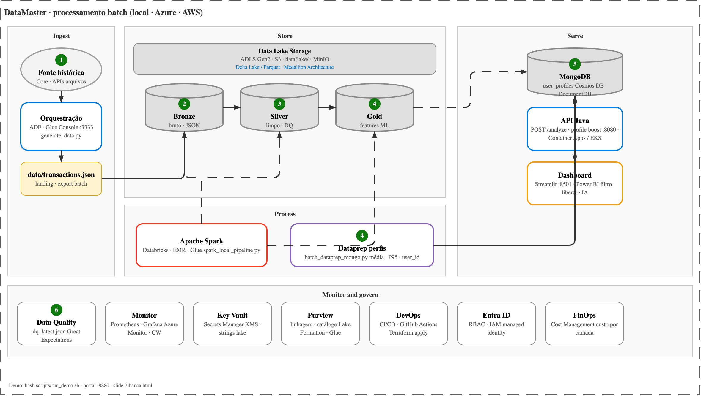
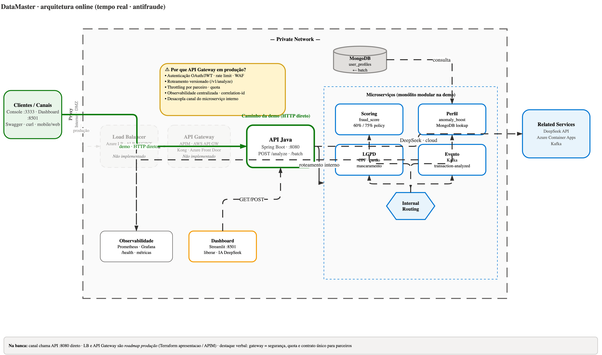
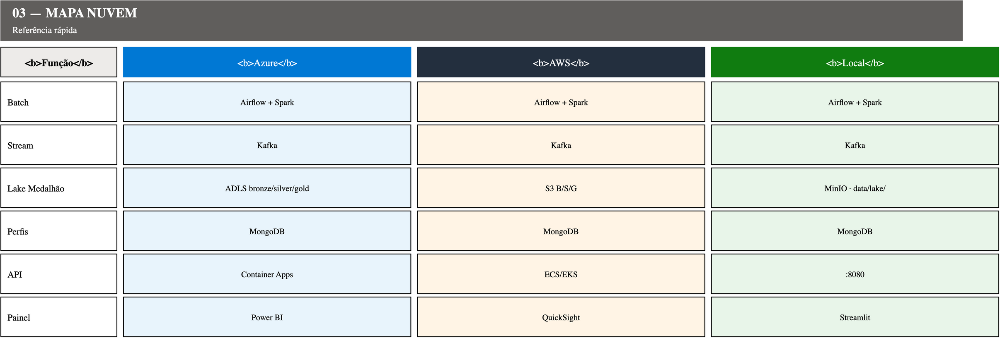

# Arquitetura DataMaster

Diagramas de arquitetura do projeto (o que a banca deve ver).

## Visão geral ponta a ponta

*Editável: `datamaster-00-visao-geral.drawio` (abrir no app.diagrams.net) → exportar JPG.*

## Batch Medallion

## Online / Serving

## Mapa multicloud

---

**Arquitetura ponta a ponta (texto):** ver [README raiz](../../readme.md) — seções "Arquitetura geral" e "Arquitetura de dados (detalhada)".

Diagramas editáveis: `.drawio` (abrir no app.diagrams.net).
