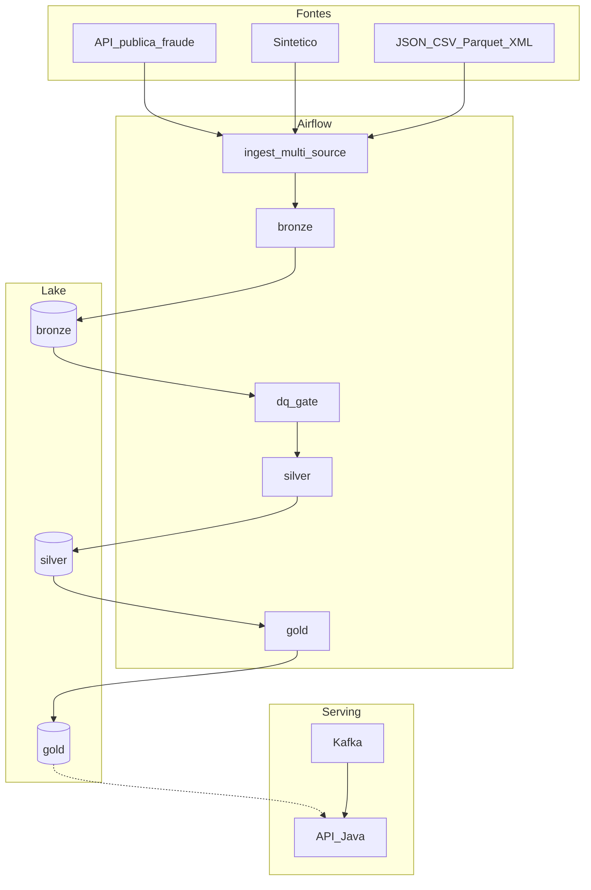

# Arquitetura DataMaster (visão engenharia de dados)

- Paths: `src/data_architecture/medallion.py`
- Transformações: `src/data_processing/`
- DAGs: `airflow/dags/`
- Cloud: Azure (ADLS + Kafka + MongoDB + Airflow/Spark)

Removido do discurso: Lambda architecture, RabbitMQ, comparação AWS.
