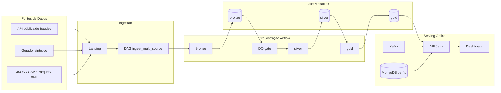
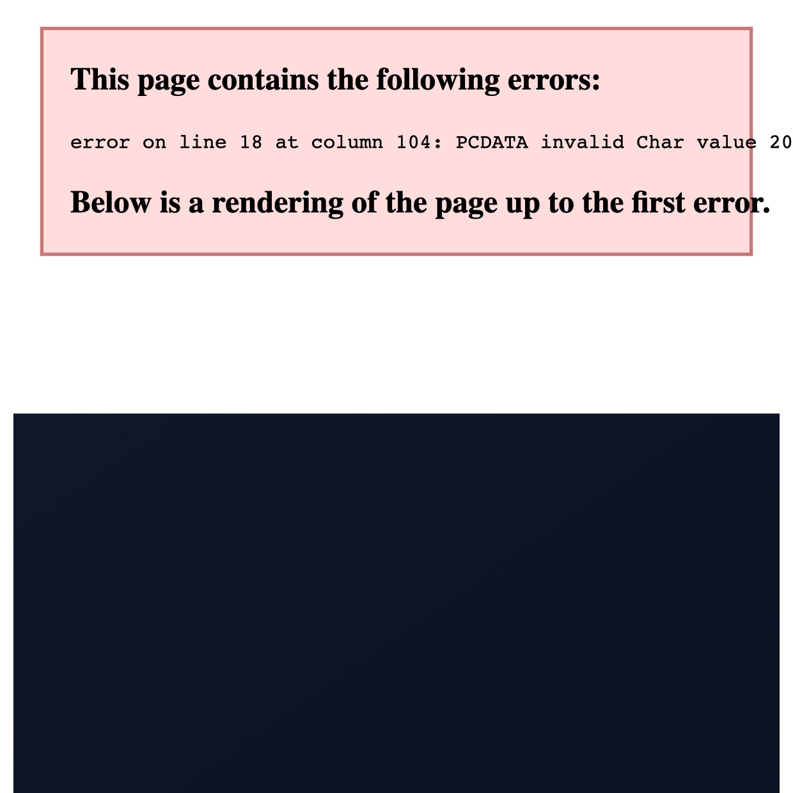
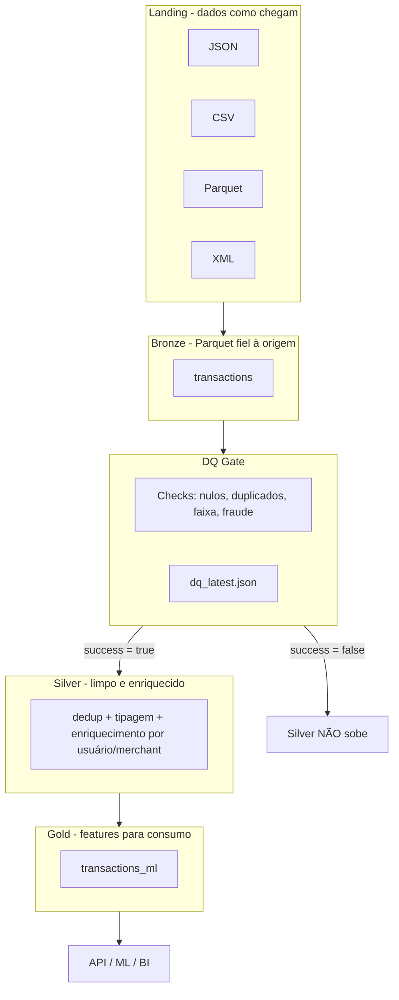

# DataMaster — Plataforma de Engenharia de Dados para Detecção de Fraudes

**Papel:** Arquiteto de Solução & Engenheiro de Dados.

Plataforma de dados para detecção de fraude em transações: pipeline **Medallion** (Bronze → Silver → Gold) orquestrado por **Apache Airflow**, lake com contrato de paths único, streaming **Kafka** e perfis analíticos em **MongoDB**. A camada **online (API + dashboard + portal)** é o serving que demonstra o pipeline funcionando de ponta a ponta.

> Leitura para a banca: a seção [Mapa de código ↔ arquitetura](#mapa-de-código--arquitetura) mostra onde está cada peça do código.

---

## 1. Problema de negócio

Bancos precisam detectar fraude em tempo quase real, com volume alto e dados vindos de muitas fontes. Isso exige:

- **ingestão confiável** de múltiplos formatos e fontes (inclusive dados públicos);
- **histórico reprocessável** (lake) para auditoria, backfill e ML;
- **qualidade de dados como gate** — dado ruim não avança de camada;
- **serving de score** em baixa latência para canais (API).

---

## 2. Arquitetura geral (dados + online)





*Diagrama editável: `docs/arquitetura/datamaster-00-visao-geral.drawio` · imagem: `docs/arquitetura/datamaster-00-visao-geral.jpg`*

---

## 3. Arquitetura de dados (detalhada)

### 3.1 Fluxo por camada



### 3.2 Decisões de engenharia de dados

| Decisão | Por quê |
|---------|---------|
| **Parquet** | Colunar, compacto (Snappy), schema evolutivo, eficiente no Spark |
| **Particionamento por `transaction_date`** | Poda de partição — leituras diárias leem só o dia |
| **DQ como gate** | Dado sujo para de fluir: `silver` depende do gate `success=true` |
| **Jobs por camada (Airflow)** | Reprocesso seletivo, falha isolada, retry por task |
| **`run_id` / pastas de run** | Idempotência e rastreabilidade da execução |
| **Contrato de paths único** | `src/data_architecture/medallion.py` — código, Airflow e Terraform falam a mesma língua |
| **Kafka como barramento** | Evento de negócio `transaction-analyzed` desacoplado do HTTP; mesmo contrato na nuvem |
| **MongoDB para perfis** | Feature store leve para o `/analyze` não fazer full scan no lake |
| **Adapter canônico** | Fontes diferentes → schema único (transação, usuário, valor, país, fraude) |
| **Multi-formato na landing** | Prova ingestão real: JSON, CSV, Parquet, XML + fonte pública |

### 3.3 Dicionário de camadas

| Camada | Papel | Formato | Onde (path) |
|--------|-------|---------|-------------|
| Landing | Dado como chega | JSON/CSV/Parquet/XML | `data/landing/run=*/` |
| Bronze | Fiel à origem, auditável | Parquet | `data/lake/bronze/transactions/` |
| Silver | Limpo, dedup, enriquecido | Parquet por data | `data/lake/silver/transactions/` |
| Gold | Features p/ ML/BI | Parquet por data | `data/lake/gold/transactions_ml/` |
| DQ report | Relatório do gate | JSON | `data/lake/reports/dq_latest.json` |

---

## 4. Mapa de código ↔ arquitetura

Para o analisador da banca localizar cada peça rapidamente:

| Componente | Código | O que faz |
|------------|--------|-----------|
| Orquestração (DAGs) | [`airflow/dags/medallion_pipeline.py`](airflow/dags/medallion_pipeline.py) | Bronze → DQ → Silver → Gold |
| Orquestração (ingestão) | [`airflow/dags/ingest_multi_source.py`](airflow/dags/ingest_multi_source.py) | Landing multi-formato |
| Orquestração (e2e) | [`airflow/dags/datamaster_e2e.py`](airflow/dags/datamaster_e2e.py) | Gatilho do fluxo completo |
| Bronze | [`src/data_processing/bronze.py`](src/data_processing/bronze.py) | Landing → Parquet |
| DQ gate | [`src/data_processing/dq.py`](src/data_processing/dq.py) | Checks + `success` |
| Silver | [`src/data_processing/silver.py`](src/data_processing/silver.py) | Clean + enrich |
| Gold | [`src/data_processing/gold.py`](src/data_processing/gold.py) | Features ML |
| Backend alternativo | [`src/data_processing/pandas_pipeline.py`](src/data_processing/pandas_pipeline.py) | Mesmo layout sem Spark (worker leve) |
| Contrato de paths | [`src/data_architecture/medallion.py`](src/data_architecture/medallion.py) | `MedallionLayout` |
| Ingestão multi-formato | [`src/data_ingestion/landing_writer.py`](src/data_ingestion/landing_writer.py) | Escreve JSON/CSV/Parquet/XML |
| Fonte pública | [`src/data_ingestion/public_fraud_sources.py`](src/data_ingestion/public_fraud_sources.py) | Dados públicos de fraude |
| Streaming | [`src/data_ingestion/kafka_client.py`](src/data_ingestion/kafka_client.py) | Producer/Consumer Kafka unificado |
| Adapters | [`src/data_ingestion/transaction_adapters.py`](src/data_ingestion/transaction_adapters.py) | Normalização p/ schema canônico |
| CLI do pipeline | [`scripts/ingest_landing.py`](scripts/ingest_landing.py) · [`scripts/medallion_job.py`](scripts/medallion_job.py) | Executar local |
| Serving | [`api-java/`](api-java/) | API de score online |
| Dashboard | [`src/dashboard/app.py`](src/dashboard/app.py) | UI analista (inclui LGPD) |
| IaC Azure | [`infrastructure/terraform/apresentacao/`](infrastructure/terraform/apresentacao/) | Kafka + Mongo + ADLS + API |
| IaC AWS (preparado) | [`infrastructure/terraform/aws/`](infrastructure/terraform/aws/) | S3 + mesma stack |

---

## 5. Requisitos da banca — como o projeto atende

| # | Requisito | Onde está |
|---|-----------|-----------|
| 1 | **Extração** | `src/data_ingestion/` — sintético + API/dataset público |
| 2 | **Ingestão** | Landing multi-formato (JSON, CSV, Parquet, XML) + Kafka |
| 3 | **Armazenamento** | Lake Medallion `data/lake/{bronze,silver,gold}` |
| 4 | **Observabilidade (dados + online)** | `dq_latest.json`, logs Airflow por task; online: Prometheus `:9090` + Grafana `:3000` |
| 5 | **Segurança** | Key Vault/`.env`, rede interna, TLS/SASL no Kafka, mascaramento |
| 6 | **LGPD** | `POST /api/v1/lgpd/mask`, minimização, hash+salt, aba LGPD no dashboard |
| 7 | **Arquitetura de dados** | Medallion + DQ gate + serving (ver seções 2–3) |
| 8 | **Escalabilidade** | Airflow por camada, Spark batch, Kafka com partições/consumer groups, lake particionado |
| — | **Multicloud** | Mesma stack em Docker, Azure e AWS preparado |
| — | **Online (complemento)** | API + dashboard + portal provam o pipeline funcionando |

---

## 6. Tópicos da apresentação

| # | Tópico | O que mostrar | Código de referência |
|---|--------|---------------|----------------------|
| 1 | Problema e papéis | Por que fraude precisa de dados organizados | — |
| 2 | Arquitetura geral | Diagrama da seção 2 (batch + streaming + serving) | `readme.md` |
| 3 | Ingestão multi-formato | `data/landing/run=*/` com 4 formatos | `ingest_multi_source.py`, `landing_writer.py` |
| 4 | Orquestração Medallion | DAG `medallion_pipeline` task a task | `medallion_pipeline.py` |
| 5 | DQ como gate | `dq_latest.json` e bloqueio Silver | `dq.py` |
| 6 | Lake e formatos | Parquet + particionamento por data | `bronze.py`, `silver.py`, `gold.py` |
| 7 | Streaming e contratos | Kafka `transaction-analyzed` | `kafka_client.py` |
| 8 | Serving online | API + dashboard (prova de valor) | `api-java/`, `src/dashboard/app.py` |
| 9 | LGPD e segurança | Mascaramento e minimização | `/lgpd/mask`, dashboard |
| 10 | Multicloud e Azure | Tabela única + opções gerenciadas | seções 9–10 |

---

## 7. Quick start (Docker local)

```bash
docker compose up -d --build
open http://localhost:8880          # Portal
open http://localhost:8085          # Airflow (admin / admin)
open http://localhost:8080/health   # API serving

# Pipeline de dados
# Airflow UI → Trigger datamaster_e2e
# ou:
python3 scripts/ingest_landing.py
python3 scripts/medallion_job.py all --backend pandas

docker compose run --rm spark-job   # opcional PySpark
```

---

## 8. Multicloud (única tabela)

Mesmos componentes; só muda o ambiente de execução e o object storage do lake.

| Componente | Docker local | Azure | AWS (preparado) |
|------------|--------------|-------|-----------------|
| Orquestração | Airflow | Airflow | Airflow |
| Processamento | Spark | Spark | Spark |
| Streaming | **Kafka** | **Kafka** | **Kafka** |
| NoSQL / perfis | **MongoDB** | **MongoDB** | **MongoDB** |
| Lake (object storage) | MinIO | ADLS Gen2 | S3 |
| Serving | api-java | api-java | api-java |
| IaC | `docker-compose.yaml` | `terraform/apresentacao` | `terraform/aws` |

Detalhe: [`infrastructure/MAPA_LOCAL_AZURE.md`](infrastructure/MAPA_LOCAL_AZURE.md)

---

## 9. Possibilidades na Azure

Plano de evolução para produção com opções gerenciadas — mantendo o **mesmo contrato** de dados:

| Componente atual | Opção gerenciada na Azure | Mesmo contrato |
|------------------|---------------------------|----------------|
| Kafka | **Event Hubs** (compatível com a API Kafka) | Producer/Consumer Kafka continuam |
| MongoDB | **Azure Cosmos DB (API MongoDB)** | Mesma collection `user_profiles` |
| Spark | **Azure Databricks** / **Synapse Spark** | Mesmos jobs PySpark |
| Airflow | **Azure Data Factory** ou Airflow gerenciado | Orquestração Bronze → Silver → Gold |
| MinIO / lake | **Azure Data Lake Gen2** | Mesmos paths `bronze`/`silver`/`gold` |
| API | **Azure Container Apps** + ACR | Mesma imagem `api-java` |

---

## 10. Docs essenciais

| Doc | Público |
|-----|---------|
| Este README | Banca / engenharia |
| [`docs/VISAO_GESTAO.md`](docs/VISAO_GESTAO.md) | Gestor |
| [`docs/operacao/CHECKLIST_DEMO_BANCA.md`](docs/operacao/CHECKLIST_DEMO_BANCA.md) | Demo ao vivo |
| [`infrastructure/MAPA_LOCAL_AZURE.md`](infrastructure/MAPA_LOCAL_AZURE.md) | Tabela multicloud |
